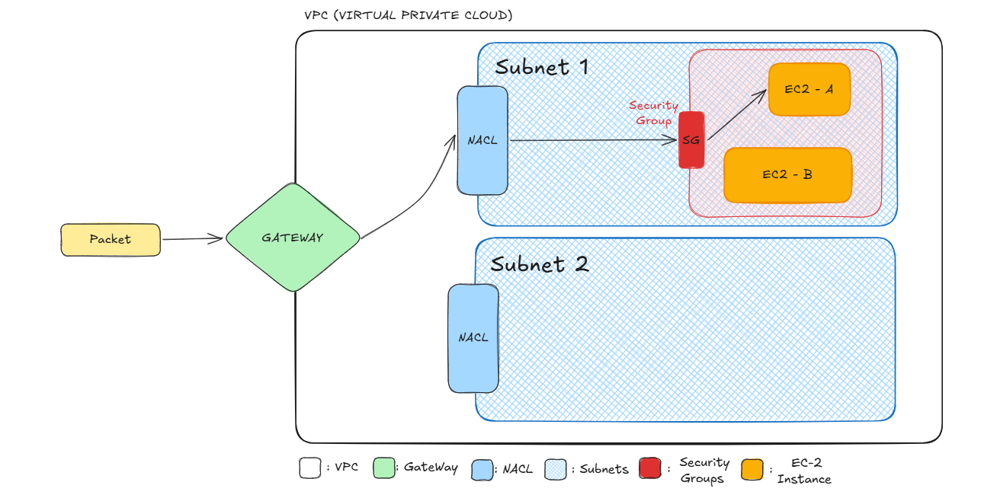

# ⚙️ Amazon EC2 – Elastic Compute Cloud

## 🚀 What is EC2?

**Amazon EC2 (Elastic Compute Cloud)** is a web service that provides secure, resizable compute capacity in the cloud. It’s essentially a virtual server (instance) that can run your applications.

> EC2 lets you launch and manage virtual machines using pre-configured or custom AMIs (Amazon Machine Images).

---

## 📦 EC2 Basics

- **Start/Stop**: You can start and stop instances as needed. When stopped, you are not charged for compute time, but still for storage (EBS).
- **Terminate**: Deletes the instance permanently and detaches the volume (if not retained).
- **State Persistence**:
  - **Stopped EC2** = No compute billing
  - **Terminated EC2** = Gone forever

---

## 🔐 Key Pairs

Key pairs are used for **SSH access** to your instance.

- **Public Key**: Stored by AWS and injected into your EC2 instance.
- **Private Key (.pem)**: Downloaded once by you and used to authenticate via SSH.

> If you lose your `.pem` file, you cannot connect to your instance again. Always keep it secure.

---

## 🖥️ SSH into EC2 (Linux)

1. Ensure your key file is secured:
   - Permissions should be set to read-only: `chmod 400 key.pem` (if using CLI later).
2. Use an SSH client (e.g., Terminal or PuTTY) to connect.
3. Format:
```
ssh -i "key.pem" ec2-user@<Public-IP>
```

> You'll get the username (e.g., `ec2-user`, `ubuntu`, `admin`) from the AMI documentation.

---

## 📍 Elastic IP (Static IP)

By default, EC2 instances get a **dynamic public IP** that changes on every start/stop. To make the IP persistent:

- Allocate an **Elastic IP** from the EC2 dashboard.
- Associate it with your EC2 instance.

> Elastic IPs are **free only when attached to a running instance**. You get charged if it’s allocated but unused.

---

## 🔐 Security Groups (SG)

Security Groups act like **virtual firewalls** for your EC2 instances.

- **Stateful**: If a request comes in, the response is automatically allowed out.
- You define **Inbound Rules** (e.g., allow SSH or HTTP).
- **Outbound Rules** are open by default but can be restricted.

### Examples:
- Allow SSH from your IP:
- Type: SSH, Port: 22, Source: My IP
- Allow HTTP:
- Type: HTTP, Port: 80, Source: Anywhere (0.0.0.0/0)

> SGs are attached at the **instance level**.

---

## 🕸️ VPC Network Flow to EC2

Understanding how traffic flows from the internet to your EC2 instance is crucial for secure architecture.

### 📦 Flow: Internet to EC2 Instance



1. **Internet Gateway (IGW)**  
- Connects your VPC to the internet. Required for public access.

2. **Route Table**  
- Contains routing rules. It must have a rule like:  
  `0.0.0.0/0 → igw-xxxxxxxx`

3. **NACL (Network Access Control List)**  
- Acts like a firewall at the **subnet level**.
- **Stateless**: Rules must be explicitly defined for both inbound and outbound traffic.
- Evaluated before traffic reaches the Security Group.

4. **Security Group (SG)**  
- At the **instance level**.
- Controls **inbound** rules.
- Automatically allows return traffic for outgoing responses.

5. **EC2 Instance**  
- Receives the traffic if it passes through all the above layers.

---

### 🔍 NACL vs. Security Group

| Feature | NACL | Security Group |
|--------|------|----------------|
| Level | Subnet | Instance |
| Type | Stateless | Stateful |
| Rule Directions | Inbound & Outbound | Inbound only (Outbound optional) |
| Rule Evaluation | All rules evaluated | First match |
| Use Case | Broad network control | Fine-grained instance control |

---

## 🧠 Real-World Analogy

Think of your EC2 like a house:

- **Internet Gateway** is the main road that connects your colony to the world.
- **NACL** is the gate of your colony — both entry and exit are checked.
- **Security Group** is your home’s front door — you decide who can ring the bell.
- **Key Pair** is your house key — only someone with the key can enter.
- **Elastic IP** is your house address — permanent and sharable.
