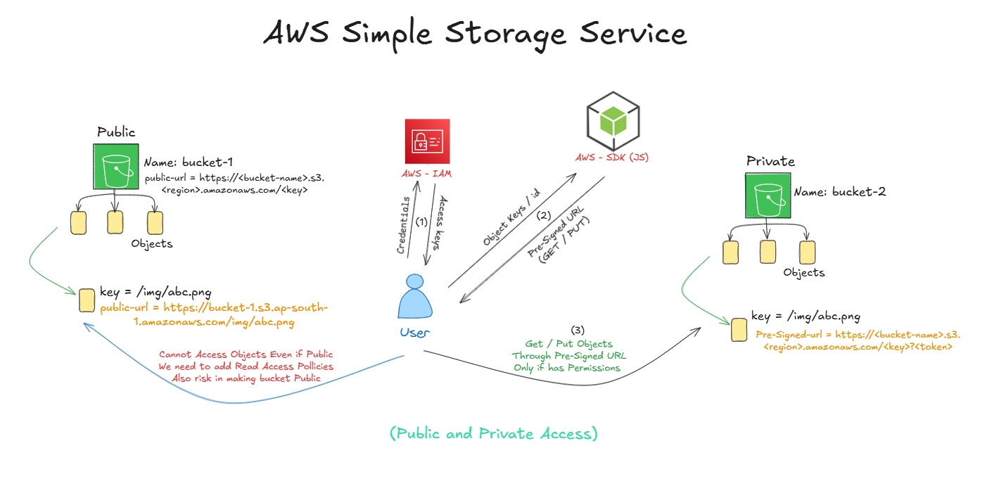

# 🪣 Amazon S3 – Simple Storage Service

## 📦 What is S3?

**Amazon S3** is a highly scalable, secure, and durable object storage service used to store and retrieve any amount of data from anywhere on the web.
It stores data as **objects** inside **buckets**. Each object consists of:
- The data itself
- A unique identifier (key)
- Optional metadata

---

## 🪣 Buckets

- A **bucket** is a top-level container for storing objects.
- Each bucket name must be globally unique.
- Buckets are created in specific **AWS regions**.

### ✅ Basic Bucket Operations

| Operation         | Description                                     |
| ----------------- | ----------------------------------------------- |
| **Create Bucket** | Define bucket name, region, and access settings |
| **Empty Bucket**  | Delete all objects (for cleanup)                |
| **Delete Bucket** | Must be empty before deletion                   |

---

## 🔒 Access Control: By Default, It's Private

- S3 buckets **block all public access** by default (for security).
- Even if an object is uploaded, its **Object URL will return Access Denied** unless permissions are explicitly granted.

---

## 📤 Upload & Access Flow

1. Upload a file (e.g., `index.html`) to S3.
2. Try accessing it via **Object URL** → ❌ _Access Denied_
3. **Remove block public access** (optional).
4. **Still denied?** Bucket Policy is required.

### ✅ Add Bucket Policy to Allow Public Access
To make a file publicly accessible:

```json
{
  "Version": "2012-10-17",
  "Statement": [
    {
      "Sid": "PublicReadGetObject",
      "Effect": "Allow",
      "Principal": "*",
      "Action": "s3:GetObject",
      "Resource": "arn:aws:s3:::your-bucket-name/*"
    }
  ]
}
```

> Always use caution when exposing buckets publicly. Prefer **pre-signed URLs** for private, time-limited access.

---

## 🌐 Static Website Hosting

S3 can host **static websites** by serving HTML/CSS/JS directly from a bucket.

### Steps:
1. Enable **Static Website Hosting** in bucket settings.
2. Set `index.html` and (optionally) `error.html`.
3. Upload site files to the bucket.
4. Configure bucket policy for public read access.
5. Use the **Static Website URL** (not the S3 object URL).

📁 _Project hosted in_ [`/static-site`](./static-site)

---

## 🔐 Pre-Signed URLs

**Pre-signed URLs** are secure, temporary URLs to upload/download objects from **private buckets**.

> Useful for granting time-limited access without making the object or bucket public.

### Use-Cases:

| Action          | Purpose                                           |
| --------------- | ------------------------------------------------- |
| **GetObject**   | Generate a temporary URL to **download** a file   |
| **PutObject**   | Allow users to **upload** a file directly into S3 |
| **Delete/List** | Managed via SDK/API for controlled operations     |

Implemented via AWS SDK (e.g., Node.js).
- Generate GET pre-signed URLs
- Generate PUT pre-signed URLs
- List all objects in a bucket
- Delete objects from bucket

📁 _Implementation in_ [`/pre-signedUrls`](./pre-signedUrls)
> Implemented by generating pre-signed URLs, uploading files, and listing/deleting objects programmatically via Node.js.

### 🧪 Working

 

---
## Advance Concepts / Properties

### 🔁 Lifecycle Rules
- Automatically transition objects to different storage classes (e.g., Archive, Glacier).
- Example: After 30 days, move infrequently accessed files to Glacier to reduce cost.

### 🧬 Replication Rules
- Automatically replicate data from one bucket to another.
- Used for backup, cross-region availability, or compliance.

### 📦 Inventory Configuration
- Create a CSV manifest of all bucket contents.
- Helpful for auditing, reporting, and compliance.
- Can be configured to run daily/weekly.

---

### 💰 Budgeting & Cost Breakdown
| Type                       | Cost                                                         |
| -------------------------- | ------------------------------------------------------------ |
| **Inbound Data Transfer**  | ✅ Free (Uploading to S3)                                     |
| **Storage**                | 📦 Charged based on size & class (standard, archive, glacier) |
| **Outbound Data Transfer** | 🌐 Charged based on volume (e.g., downloads to internet)      |
> 💡 Use Lifecycle Rules + Replication carefully to optimize costs.

## 🛠️ AWS SDK & API

- Almost everything done via console (upload, delete, permissions) can be done programmatically.
- Common languages: **Node.js**, **Python**, **Java**, etc.
- SDKs enable full automation and seamless integration into applications.
