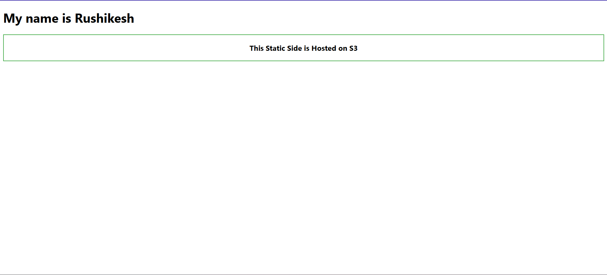

# 🌐 Static Website Hosting on AWS S3

This simple static site demonstrates how to host an HTML website directly from an **Amazon S3 bucket**.

---

## 📁 Project Structure

```bash
/static-site/
│
├── index.html      # Main HTML file
└── styles.css      # Optional CSS styling (add if needed)
```

---

## 🚀 Hosting Steps (via AWS Console)

1. **Create a Bucket**
   - Go to [S3 Console](https://s3.console.aws.amazon.com/s3/home).
   - Click **Create bucket**.
   - Choose a globally unique name (e.g., `rushikesh-static-site`).
   - Select a region.
   - **Uncheck** “Block all public access”.

2. **Enable Static Website Hosting**
   - Open the bucket.
   - Go to the **Properties** tab.
   - Scroll to **Static website hosting**.
   - Enable it.
   - Set `index.html` as the index document.

3. **Upload Your Site Files**
   - Upload `index.html` (and `styles.css` if used).
   - Keep the file structure flat (upload directly into the bucket, not inside a folder).

4. **Set Bucket Policy (Public Read Access)**

Go to the **Permissions** tab → **Bucket Policy**, and paste:

```json
{
  "Version": "2012-10-17",
  "Statement": [
    {
      "Sid": "PublicReadForWebsite",
      "Effect": "Allow",
      "Principal": "*",
      "Action": "s3:GetObject",
      "Resource": "arn:aws:s3:::<your-bucket-name>/*"
    }
  ]
}
```

🔁 Replace `<your-bucket-name>` with your actual bucket name.

5. **Access Your Site**
   - Get the **Static website hosting URL** from the Properties tab.
   - Open it in your browser 🎉

---

## ✅ Output Example

```
https://rushikesh-static-site.s3-website.ap-south-1.amazonaws.com
```

---

## 🧪 Preview

 <!-- Add a screenshot if you want -->

---

> This example is part of Rushikesh Shelar’s AWS learning journey ☁️📚  
> _Hosted using S3, no backend or server required._

