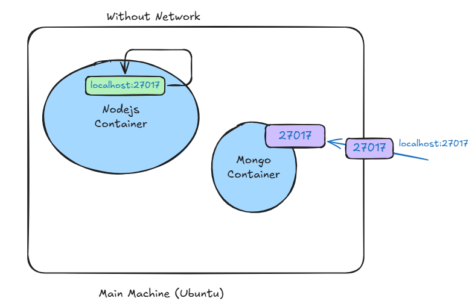
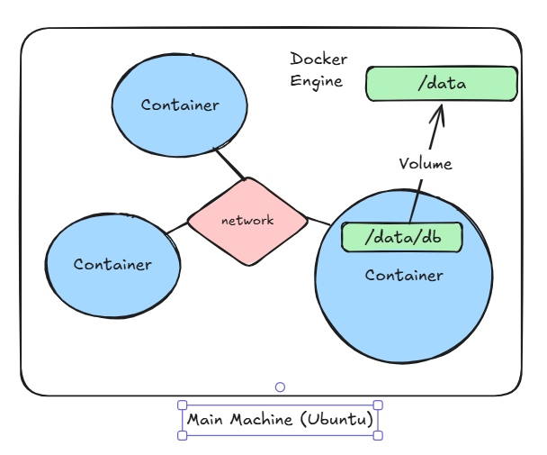

# Docker Networking

When containers run, they often need to communicate with each other, external applications, or the host machine. Docker provides a powerful networking model that enables secure and isolated communication between containers, between containers and the host, and between containers and external networks.

By default, Docker containers run in isolation, but Docker Networking makes it easy to control how containers connect and communicate.

---

## Why Docker Networking?

In a multi-container setup (such as microservices), different services (databases, APIs, frontends) need to interact. Docker networking allows:

- Communication between containers.
- Communication between host and containers.
- Isolation of containers for security.
- Custom network configurations for flexibility.

---

## Docker Networking Drivers

Docker provides several networking drivers, each suited for different use-cases. When you start Docker, a few networks are automatically created.

### 1️⃣ **bridge (default)**

- Used for standalone containers on a single host.
- Docker creates a `bridge` network automatically.
- Containers on the same bridge network can communicate with each other using container names.
- Containers are isolated from the host network.

```bash
docker network ls
```

Example of running a container on the default bridge network:

```bash
docker run -d --name web nginx
```

You can create a custom bridge network:

```bash
docker network create my-bridge
docker run -d --name db --network my-bridge mysql
docker run -d --name app --network my-bridge my-app
```

Now `app` can reach `db` using `db:port` directly.

---

### 2️⃣ **host**

- The container shares the host's network stack.
- No network isolation between host and container.
- Useful for performance-sensitive applications where you want to avoid network translation overhead.

```bash
docker run --network host nginx
```

Note: Available on Linux only (limited support on Windows and Mac).

---

### 3️⃣ **none**

- Completely disables networking for the container.
- Used for isolated workloads that don’t require any network access.

```bash
docker run --network none nginx
```

---

### 4️⃣ **overlay**

- Used for multi-host networking.
- Mostly used with Docker Swarm or orchestration tools.
- Enables containers running on different Docker hosts to communicate securely.

```bash
docker network create --driver overlay my-overlay
```

---

### 5️⃣ **macvlan**

- Assigns a MAC address to the container, making it appear as a physical device on the network.
- Allows containers to have their own IP address on the physical network.
- Useful for legacy applications that require direct Layer 2 access.

```bash
docker network create -d macvlan \
  --subnet=192.168.1.0/24 \
  --gateway=192.168.1.1 \
  -o parent=eth0 my-macvlan
```

---

## Default Networks

You can list Docker’s default networks using:

```bash
docker network ls
```

Typical output:

| Network Name | Driver | Scope |
|---------------|--------|-------|
| bridge        | bridge | local |
| host          | host   | local |
| none          | null   | local |

---

## Inspecting Networks

To see detailed configuration of any network:

```bash
docker network inspect <network-name>
```

---

## Connecting Containers to Multiple Networks

You can attach a running container to multiple networks:

```bash
docker network connect my-bridge container-name
docker network disconnect my-bridge container-name
```

---

## DNS-based Service Discovery

- Docker’s built-in DNS allows containers to resolve each other's names.
- When containers share a custom network, Docker automatically adds entries for container names in the DNS.

Example:
- Container `app` can connect to container `db` using:

```bash
mysql -h db -u root -p
```

No need to manually configure IP addresses.

---

## Exposing Ports

If you want external clients to access your container:

```bash
docker run -d -p 8080:80 nginx
```

- `-p hostPort:containerPort` maps container ports to the host.

---

## Practical Scenario Example

You have a web server and a database:

```bash
# Create a custom network
docker network create my-app-net

# Start database container
docker run -d --name db --network my-app-net mysql

# Start web application container
docker run -d --name web --network my-app-net nginx
```

- `web` can talk to `db` using `db:port` without exposing ports to the host.

---

## Summary: Driver Selection

| Use-Case | Recommended Driver |
|----------|---------------------|
| Simple container-to-container communication on single host | bridge |
| Multi-host clustering with Swarm | overlay |
| Performance-critical apps needing host’s stack | host |
| No network access | none |
| Direct Layer 2 access to physical network | macvlan |

---

> 🔥 **Tip:** For most local development and CI/CD pipelines, `bridge` networks with service discovery (container names) are the most commonly used.

---

## Key Docker Network Commands

| Command | Description |
|---------|-------------|
| `docker network ls` | List all networks |
| `docker network create <name>` | Create a network |
| `docker network rm <name>` | Remove a network |
| `docker network inspect <name>` | Inspect network configuration |
| `docker network connect` | Connect container to network |
| `docker network disconnect` | Disconnect container from network |

---

# Visual Diagram
## Without bridge Network

## Usiing a Bridge Network


