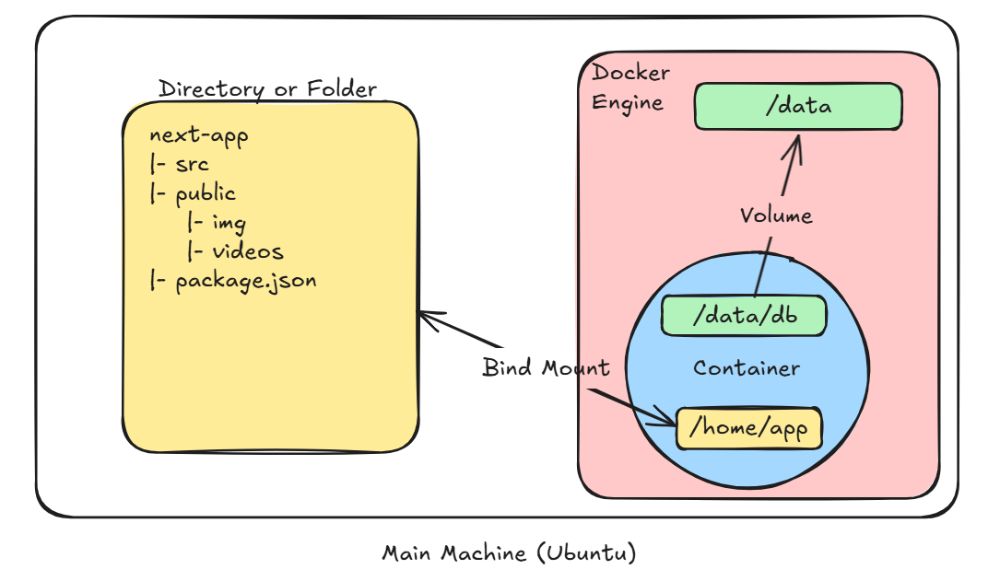

# Persisting container data (Volumes)
When a container starts, it uses the files and configuration provided by the image. Each container is able to create, modify, and delete files and does so without affecting any other containers. When the container is deleted, these file changes are also deleted.

While this ephemeral nature of containers is great, it poses a challenge when you want to persist the data. For example, if you restart a database container, you might not want to start with an empty database. So, how do you persist files?

## Container volumes
Volumes are a storage mechanism that provide the ability to persist data beyond the lifecycle of an individual container. Think of it like providing a shortcut or symlink from inside the container to outside the container.

As an example, imagine you create a volume named `log-data`.
```bash
docker volume create log-data
```

When starting a container with the following command, the volume will be mounted (or attached) into the container at `/logs`:
```bash
 docker run -d -p 80:80 -v log-data:/logs docker/welcome-to-docker
```
If the volume `log-data` doesn't exist, Docker will automatically create it for you.

When the container runs, all files it writes into the `/logs` folder will be saved in this volume, outside of the container. If you delete the container and start a new container using the same volume, the files will still be there.

## Managing volumes
Volumes have their own lifecycle beyond that of containers and can grow quite large depending on the type of data and applications you’re using. The following commands will be helpful to manage volumes:

- `docker volume ls` - list all volumes
- `docker volume rm <volume-name-or-id>` - remove a volume (only works when the volume is not attached to any containers)
- `docker volume prune` - remove all unused (unattached) volumes

## Sharing local files with containers
Each container has everything it needs to function with no reliance on any pre-installed dependencies on the host machine. Since containers run in isolation, they have minimal influence on the host and other containers. This isolation has a major benefit: containers minimize conflicts with the host system and other containers. However, this isolation also means containers can't directly access data on the host machine by default.

Consider a scenario where you have a web application container that requires access to configuration settings stored in a file on your host system. This file may contain sensitive data such as database credentials or API keys. Storing such sensitive information directly within the container image poses security risks, especially during image sharing. To address this challenge, Docker offers storage options that bridge the gap between container isolation and your host machine's data.

Docker offers two primary storage options for persisting data and sharing files between the host machine and containers: volumes and bind mounts.

### Volume versus bind mounts
If you want to ensure that data generated or modified inside the container persists even after the container stops running, you would opt for a volume. Volume mounts the data directory you want to persisits to a volume in the docker Engine.

If you have specific files or directories on your host system that you want to directly share with your container, like configuration files or development code, then you would use a bind mount. It's like opening a direct portal between your host and container for sharing. Bind mounts are ideal for development environments where real-time file access and sharing between the host and container are crucial.



### Sharing files between a host and container
Both `-v` (or `--volume`) and `--mount` flags used with the `docker run` command let you share files or directories between your local machine (host) and a Docker container. However, there are some key differences in their behavior and usage.

The `-v` flag is simpler and more convenient for basic volume or bind mount operations. If the host location doesn’t exist when using `-v` or `--volume`, a directory will be automatically created.

Imagine you're a developer working on a project. You have a source directory on your development machine where your code resides. When you compile or build your code, the generated artifacts (compiled code, executables, images, etc.) are saved in a separate subdirectory within your source directory. In the following examples, this subdirectory is `/HOST/PATH`. Now you want these build artifacts to be accessible within a Docker container running your application. Additionally, you want the container to automatically access the latest build artifacts whenever you rebuild your code.

Here's a way to use `docker run` to start a container using a bind mount and map it to the container file location.
```bash
docker run -v /HOST/PATH:/CONTAINER/PATH -it nginx
```

The `--mount` flag offers more advanced features and granular control, making it suitable for complex mount scenarios or production deployments. If you use `--mount` to bind-mount a file or directory that doesn't yet exist on the Docker host, the `docker run` command doesn't automatically create it for you but generates an error.
```bash
docker run --mount type=bind,source=/HOST/PATH,target=/CONTAINER/PATH,readonly nginx
```
- Note
Docker recommends using the `--mount` syntax instead of `-v`. It provides better control over the mounting process and avoids potential issues with missing directories.

### File permissions for Docker access to host files
When using bind mounts, it's crucial to ensure that Docker has the necessary permissions to access the host directory. To grant read/write access, you can use the `:ro` flag (read-only) or `:rw` (read-write) with the `-v` or `--mount` flag during container creation. For example, the following command grants read-write access permission.
```bash
docker run -v HOST-DIRECTORY:/CONTAINER-DIRECTORY:rw nginx
```
Read-only bind mounts let the container access the mounted files on the host for reading, but it can't change or delete the files. With read-write bind mounts, containers can modify or delete mounted files, and these changes or deletions will also be reflected on the host system. Read-only bind mounts ensures that files on the host can't be accidentally modified or deleted by a container.
